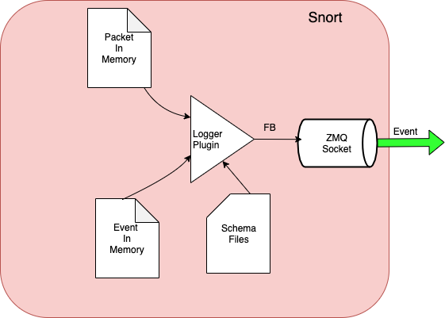

# ZMQ Flatbuffer Snort's plugin
- This is a new snort3's logger pluggin which allows snort to emit events in FB binary format (to serialize data) over ZmQ socket ZMQ_PULL type.
- Its designed to provide diskless eventing to the Event handler process.
- Eventing POD will have on ZMQ socket that can be shared among multiple 
- When ZMQ queue reach specific High water mark, snort will be back pressured for early phases when snort is BP
eventing plugin will start dropping events till BP conditions are gone.

- In the Future we can consider logging the EVents under BP conditions in local file and when BP conditions is clear
we will process the local file events emit them then resume with snorts events.

- Snort will be emitting IPS events

    


# Plugin configuration
- tcpsocket specify the Endpoint where the Event Handler is running at it can be local in the same node or could be in different node the default setting
  is "tcp://localhost:5558"
- highwatermark specify how deep the ZMQ queue can grow to before it back pressure the snort's FB plugin's socket.

# How to build
```
gradle build
```

# How to test

- need to start snort with the following
```
--plugin-path /usr/local/lib/zmqfb
-A zmqfb
```

Example :
```
snort -Q -v --daq afpacket --daq-dir /usr/local/lib/daq -c /volume/data/config/snort.lua --plugin-path /usr/local/lib/zmqfb -z1  -j 9000 -m 0x1 --daq-var fanout_type=hash -i eth0:lo --warn-all -A zmqfb
```

```
root@491dd7ee7ab7:/# /usr/local/bin/snort --warn-all --plugin-path /usr/local/lib/zmqfb --list-plugins | grep logger
logger::alert_csv v0 static
logger::alert_fast v0 static
logger::alert_full v0 static
logger::alert_json v0 static
logger::alert_sfsocket v0 static
logger::alert_syslog v0 static
logger::alert_talos v0 static
logger::alert_unixsock v0 static
logger::log_codecs v0 static
logger::log_hext v0 static
logger::log_pcap v0 static
logger::unified2 v0 static
logger::zmqfb v0 /usr/local/lib/zmqfb/logger_zmqfb.so <<<<<<<<>>>>>>>>
```
